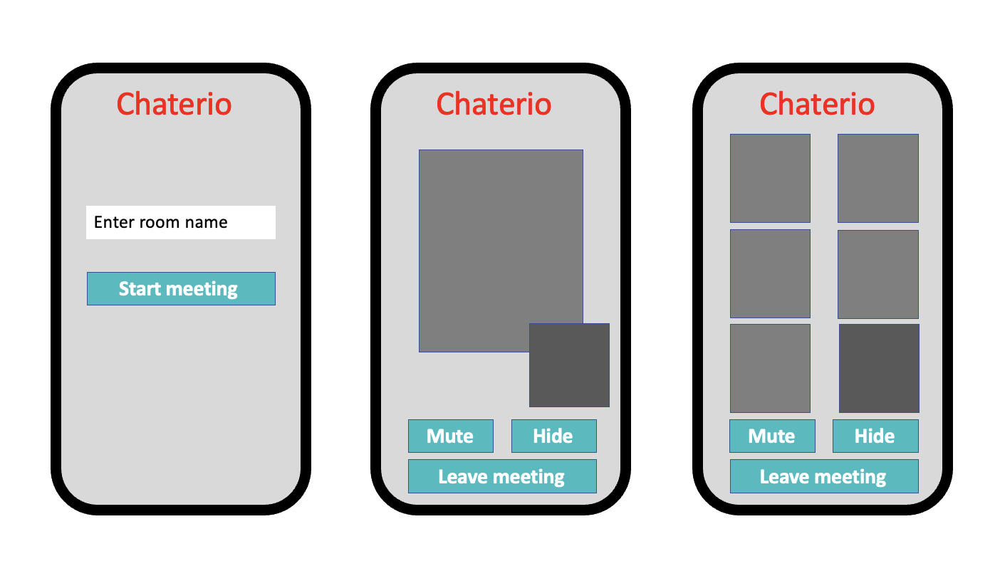
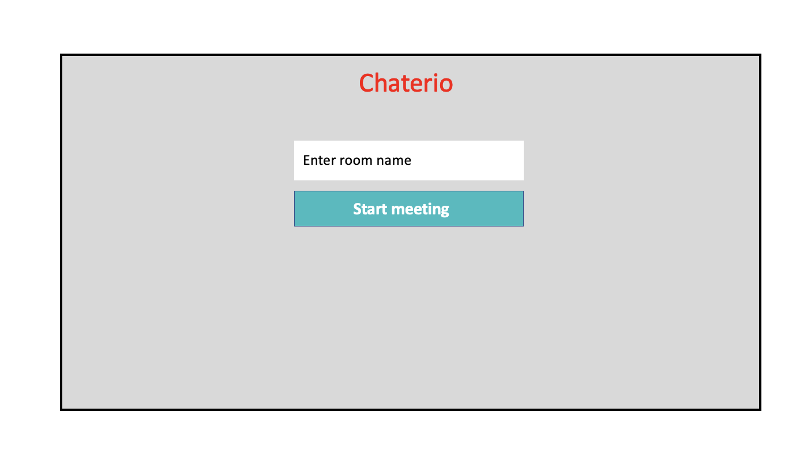
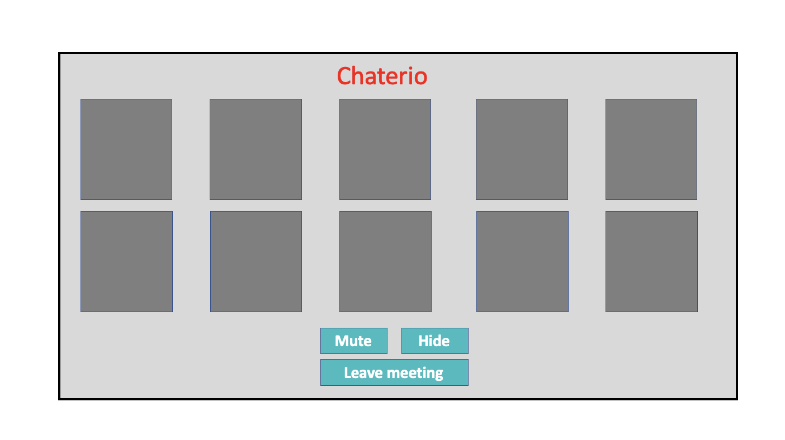

# Capstone Project - Chaterio

<p>A React/Express video chat application that allows a user to join a room and chat with other users.<p>
<p>This was a very ambitious task to complete within a two week period, and although the basic video calling is functioning it remains a little buggy, thus development process of this application is ongoing.<p>
<br>

## Contents
<p>Technologies</p>
<p>Brief</p> 
<p>Planning</p> 
<p>Installation</p> 
<br>

## Technologies
<p>These are the main technologies used to develop the project.</P>
<br>
<p>JavaScript</p>
<p>React</p>
<p>Express</p>
<p>HTML5</p>
<p>CSS3</p>
<p>WebRTC</p>
<p>PeerJS<p>
<br>

## Brief
<br>
For the Capstone project, I worked independently to explore WebSocket technologies, including socket.io and peerjs, by creating a video chat application. A rather ambitious task that went beyond the curriculum and provided a massive learning curve. MVP has been met but is a little buggy here and there. Testing has proved difficult with exploration in https certification, tunnelling via Tailscale, and Chromium. This will remain my passion/experimental project. WIP.
<br><br>

### MVP
<br>
<p>A user should be able to...<p>
<ul>
    <li>Users will be able to log on by entering their name.</li>
    <li>Users will be able to join a room via a room name.</li>
    <li>Users will be able to create a room.</li>
    <li>Users will be able to Thave video chat with other users.</li>
    <li>Users will be able to leave a room – which will redirect to homepage.</li>
    <li>A room should be able to host two users.</li>
</uL>
<br>

### Extensions:
<ul>
    <li>Users can join rooms with multiple users.</li>
    <li>Users can text other users with CRUD actions.</li>
    <li>Users can randomly join a room with strangers.</li>
    <li>Users can mute their microphone.</li>
    <li>Users can disable their camera.</li>
    <li>Host website on AWS.</li>
</ul>
<br><br>

## Planning
<br>
<p>Learning new technologies was key. YouTube tutorials, documentation for <a href="https://socket.io/docs/v4/" target="_blank">socket.io</a> and <a href="https://peerjs.com/docs/" target="_blank">peerjs</a> helped explore these technologies. The website most similar to my project is <a href="https://meet.jit.si/" target="_blank">jitsi</a> which provides a reasonable framework in which to explore. Further to this the below wireframes helped structure the look of the project.<p>
<p>It was discovered early on that the main function of the application needs a reletively small amount of code... but indeed very tricky code.<p>
<br>

<br>

<br>

<br><br>

## Installation
<br>

<p>You'll need socket.io, socket.io-client, peerjs, express, styled-components, uuid installed. Ensure you navigate to the correct folder when installing e.g. socket.io in server folder and socket.io-client in client folder.<p>
<br>

Client folder:

```
npm install socket.io-client styled-components uuid
```

Server folder:
```
npm install socket.io peerjs express nodemon
```

<br>
<p>You will need to run the front end, and two backend servers using three terminal windows.<p>
<br>

Start React application:
```
npm start
```
Start Express server:
```
npm run server:dev
```
Start peerjs server:
```
peerjs --port 9001
```


<br>
<p>Then visit http://localhost:3000/ to view the app.</p>
<br>
